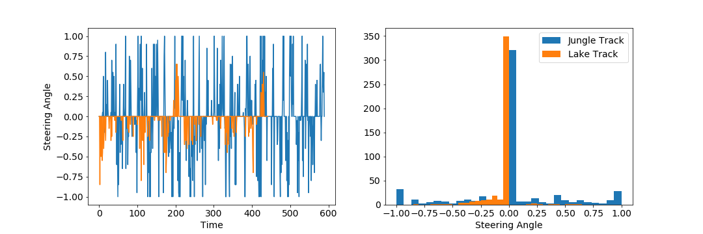
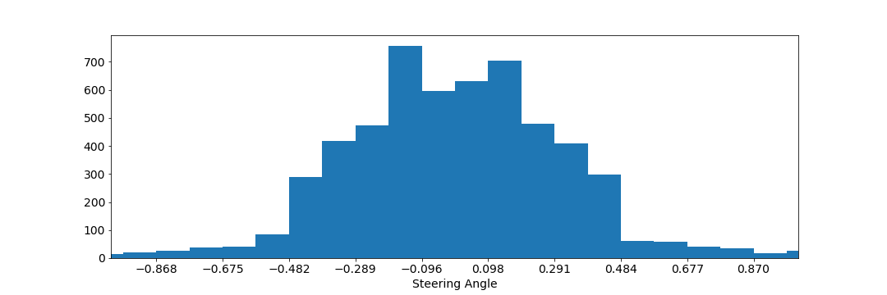

# Udacity Self-Driving Car Engineer Nanodegree

## Deep Learning 

Behavioral Cloning: Navigating a Car in a Simulator
---

The goal of this project is to train a deep neural network to drive a car in a simulator as a human 
would do. 

](https://www.youtube.com/watch?v=DUhGXYgVido)

The steps of this project are the following:

* Use the simulator to collect data of good driving behavior
* Build, a convolution neural network in Keras that predicts steering angles from images
* Train and validate the model with a training and validation set
* Test that the model successfully drives around track one without leaving the road

**The model drives correctly all the available tracks from the udacity course, while being trained only on
the lake and the jungle track. Here are some videos of the model driving around**

[](http://www.youtube.com/watch?v=GTDBoOSJ20E "Lake Track Success")
[](http://www.youtube.com/watch?v=DUhGXYgVido "Jungle Track Success")
[](http://www.youtube.com/watch?v=foVvq6IwuDk "Mountain Track Success")

[Lake Track Success](http://www.youtube.com/watch?v=GTDBoOSJ20E "Lake Track Success") | 
[Jungle Track Success](http://www.youtube.com/watch?v=DUhGXYgVido "Jungle Track Success") |
[Mountain Track Success](http://www.youtube.com/watch?v=foVvq6IwuDk "Mountain Track Success")


---
### Files Submitted 


My project includes the following files:

* `models.py` containing the definition of the Keras models 
* `train.py` containing the training loop for the model
* `drive.py` for driving the car in autonomous mode (N.b. this file was modified to increase the speed of the car)
* `models/model.h5`, should contain the trained convolution neural network which can be downloaded [here](https://s3.eu-central-1.amazonaws.com/luca-public/udacity/behavioural-cloning/models_done2.zip) 
* `data_pipe.py`, containing code for generators which stream the training images from disk and apply data augmentation
*  `fabfile.py`, fabric file which is used for automation (uploading code to AWS and download trained model)
*  `data` , folder containing the training data which can be dowloaded [here](https://s3.eu-central-1.amazonaws.com/luca-public/udacity/behavioural-cloning/data.zip) 
* `README.md` summarizing the project

Using the Udacity provided simulator and my `drive.py` file, the car can be driven autonomously around the track by executing 
```sh
python drive.py models/model.h5
```
---
###Model Architecture and Training Strategy

#### Model architecture 

The project was developed over iterations. First, I established a solid data loading and processing pipeline to allow faster adjustment to the modeling part in the next steps.
For this reason, the generators to stream training and validation data from disk were implemented in `data_pipe.py` in such a way that I could easily add more training and validation data.
The data is organized in the folders under `data`, each sub folder corresponds to different runs (explained later) and if a new folder is added this is automatically added 
by the generators to the training / validation loop.  Also, I wrote a fabric file to easily upload data and code to AWS, train the model and download the result to run the simulation locally.

In order to establish the training and testing framework I initially used a very simple network with only one linear layer.
However, the final model architecture (`models.py` lines 56-93) is inspired to the architecutre published
 [published by the Nvidia team ](https://devblogs.nvidia.com/parallelforall/deep-learning-self-driving-cars/).
It consist of a convolution neural network with the following layers and layer sizes.

```
_________________________________________________________________
Layer (type)                 Output Shape              Param # 
=================================================================
lambda_1 (Lambda)            (None, 160, 320, 3)       0
_________________________________________________________________
cropping2d_1 (Cropping2D)    (None, 70, 320, 3)        0
_________________________________________________________________
conv2d_1 (Conv2D)            (None, 70, 320, 3)        12
_________________________________________________________________
conv2d_2 (Conv2D)            (None, 33, 158, 24)       1824
_________________________________________________________________
conv2d_3 (Conv2D)            (None, 15, 77, 36)        21636
_________________________________________________________________
conv2d_4 (Conv2D)            (None, 6, 37, 48)         43248
_________________________________________________________________
conv2d_5 (Conv2D)            (None, 4, 35, 64)         27712
_________________________________________________________________
conv2d_6 (Conv2D)            (None, 2, 33, 64)         36928
_________________________________________________________________
flatten_1 (Flatten)          (None, 4224)              0
_________________________________________________________________
dense_1 (Dense)              (None, 1164)              4917900
_________________________________________________________________
dropout_1 (Dropout)          (None, 1164)              0
_________________________________________________________________
dense_2 (Dense)              (None, 100)               116500
_________________________________________________________________
dropout_2 (Dropout)          (None, 100)               0
_________________________________________________________________
dense_3 (Dense)              (None, 50)                5050
_________________________________________________________________
dropout_3 (Dropout)          (None, 50)                0
_________________________________________________________________
dense_4 (Dense)              (None, 10)                510
_________________________________________________________________
dense_5 (Dense)              (None, 1)                 11
=================================================================
Total params: 5,171,331
Trainable params: 5,171,331
Non-trainable params: 0
_________________________________________________________________
```

Compared to the original Nvidia architecture there are some differences
 
- Rectified linear units were used throughout the entire network except for
the initial and final layer.  
- `lambda_1` implements normalization layer which shifts pixel values in `[-1,1]` 
- `cropping2d_1` removes the 65 and the bottom 25 pixels
- `conv2d_1` is a 3x3 convolutional layer with linear activation which is used to allow the model to learn automatically 
a transformation of intial RGB color space to be used (trick taken [here](https://chatbotslife.com/using-augmentation-to-mimic-human-driving-496b569760a9) )

The validation set helped to determine if the model was over or under fitting. 
As explained in the data collection part the validation set consisted of two full laps around the Lake and Jungle tracks 
and was saparated from the training set. Qualitatively a lower `MSE` on the validation correlate well with an improved 
driving behaviour of the car. In order to reduce overfitting an aggressive dropout (droupout prob .30) was used between 
the last three final fully connected layers as well as data augmentation strategies (described later). 

Also, I used an adam optimizer so that manually  training the learning rate wasn't necessary and used 
early stopping with patience of 3 to decide the optimal number of epochs (which happend to be around 20 most of the times).


#### Creation of the Training / Validation Set & Training Process

We use the `jungle` track and the `lake` track for training and validation and we keep the `mountain` track as an independent 
test to assess the generalization capabilities of this model set.


To capture good driving behavior, I first recorded two datasets each one consisting of one full 
lap on the lake track while using center lane driving.   I then recorded two other datasests the vehicle recovering from the 
left side and right sides of the road back to center so that the vehicle would learn to come back on track when too close to the side lane.

Then I repeated this process on the mountain track two in order to get more data points.

From a look at the distribution of twe steering angles for these two tracks (shown below) is evident that the Jungle track 
is much more challenging with a  much larger steering agle required. Also, the Lake track has a bias 
towards negative steering angles.



For these reasons I decided to augment the data using random transformations of the images. 
The image transformations, implemented in `data_pipe.py` ( suggested [in this blog](https://devblogs.nvidia.com/parallelforall/deep-learning-self-driving-cars/) )  include:

- flipping images
- adding shadows to the images
- using left and right camera images
- adding random horizontal shifts to the images
- randomizing image brightness

Here some examples of the augmented images with the corresponding steering angles:


After these operations the distribution of the steering angles on the training set appear much more balanced and similar 
to a bell shape



Finally, since at the end my model was still drifting on a very difficult curve on the first track I added a few more frames which
would allow the model to learn the correct driving behaviour on that part of the track and finally be able to solve correctly all the
three challenges (Lake, Mountain, Jungle).


